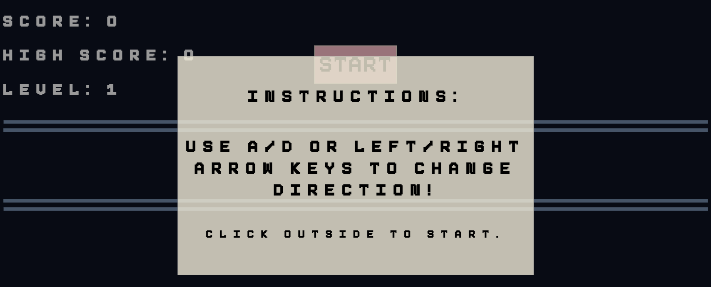
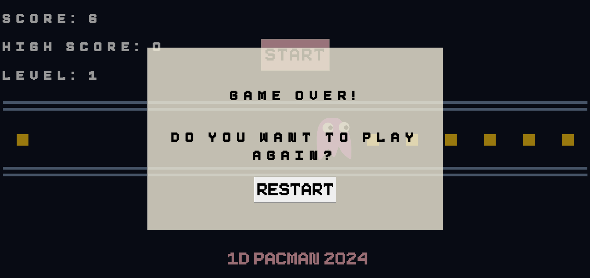

# Pacman Game Design System

This document outlines the visual design system for the Pacman game we did for Assignment 2. It includes the structural components, color palette, and font styles used throughout the game.

## Structural Components
- **Header**: Located at the top of the screen, contains scoreboar which displays the current score, high score, and current level, as well as the start button. 
  
- **Initial Instruction Menu**: The initial menu that explains the game controls and how to start the game. 
  
- **Play Area**: The middle area of the game, smain area where the game is played. 
  
- **Restart Menu**: Appears when game is over.  
  
- **Footer**: Located at the bottom, includes name of game. 
  

## Color Palette
- **Primary Color**: #0D1321 (Dark Blue) - Used for the background color of the body.
- **Secondary Color**: rgb(240, 235, 216, 0.8) (Beige) - Used for the backgrounds of nitial instruction menu and restart menu.
- **Accent Color**: lightpink - Used for the background color of #begin-button:hover and the color of footer.
- **Text Color**: white - Used for the color of score board display

## Fonts and Sizes
- **Primary Fonts**: 'Pixieboy', sans-serif - Used for all text contained in game (Used for h1, #begin-button, .modal-content, modal-instruction-content, #restart, and p elements) 
- **Sizes**: 4vw for all header and button text, font-size: 30px for intsructions. 

## Assets
All design-related assets are located in the `/docs/design_system` directory.
- Header design: `header_design.png`
- Footer design: `footer_design.png`
- Play area design: `play_area_design.png`...etc. 